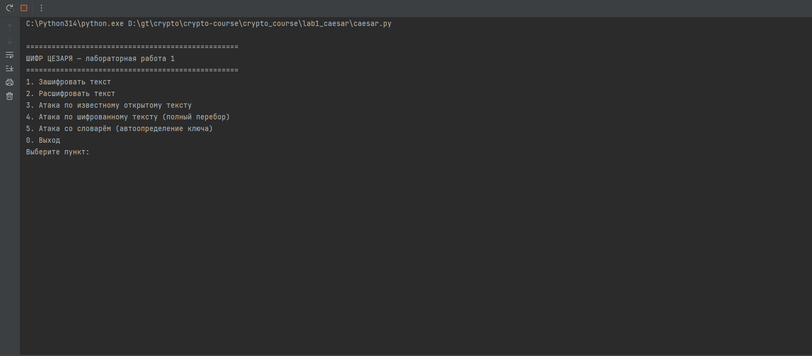

# Лабораторная работа 1 — Шифр Цезаря

Реализация шифра Цезаря для латинского алфавита (26 букв, ключ 0–25).

## Возможности

1. **Зашифрование / расшифрование** текста шифром Цезаря
2. **Атака по известному открытому тексту** — определение ключа по паре открытый/зашифрованный текст
3. **Атака по шифрованному тексту** — полный перебор всех 26 ключей
4. **Атака со словарём** — автоматическое определение ключа с помощью словаря английских слов

## Запуск

```bash
python caesar.py
```

## Демонстрация


