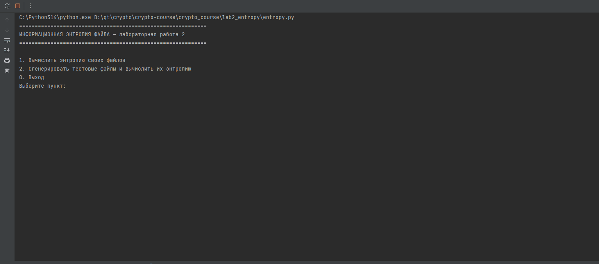

# Лабораторная работа 2 — Информационная энтропия

Вычисление частот символов и информационной энтропии файлов.

## Возможности

1. **Подсчёт частот** появления байтов в файле
2. **Вычисление энтропии** Шеннона по частотам
3. **Генерация тестовых файлов**:
   - одинаковые символы (энтропия → 0)
   - случайные 0/1 (энтропия → log2(2) = 1)
   - случайные байты 0..255 (энтропия → log2(256) = 8)
   - смещённое распределение (энтропия между крайностями)

## Запуск

```bash
python entropy.py
```

## Демонстрация


