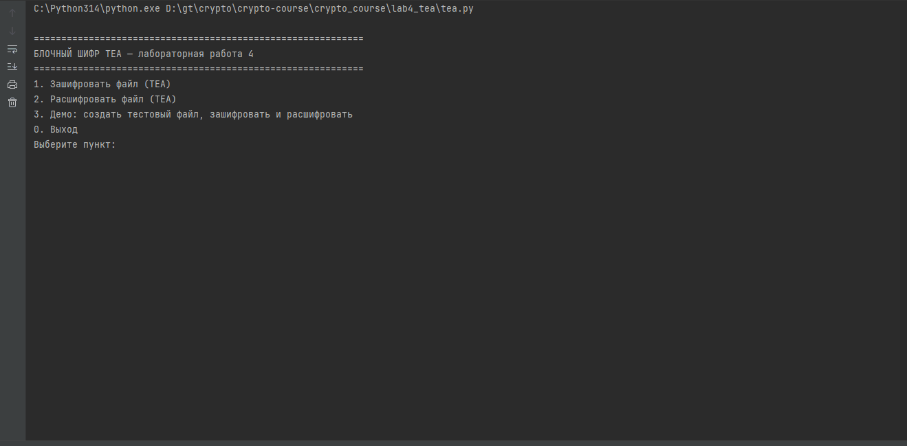

# Лабораторная работа 4 — Блочный шифр TEA

Реализация итеративного блочного шифра TEA (Tiny Encryption Algorithm).

## Характеристики

- Размер блока: 8 байт (64 бита)
- Размер ключа: 16 байт (128 бит)
- Количество раундов: 32
- Используется PKCS7 padding

## Возможности

1. **Зашифрование файлов** блочным шифром TEA
2. **Расшифрование файлов** блочным шифром TEA
3. **Демо-режим** — автоматическое создание тестового файла, шифрование и проверка расшифрования

## Запуск

```bash
python tea.py
```

## Демонстрация


