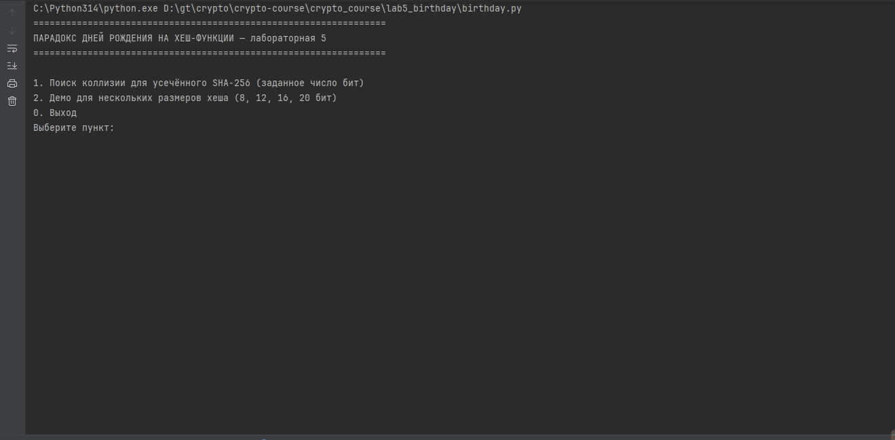

# Лабораторная работа 5 — Парадокс дней рождения на хеш-функции

Демонстрация парадокса дней рождения с использованием криптографической хеш-функции SHA-256.

## Суть

Используем усечённый SHA-256 (только N младших бит) и ищем коллизию 2-го рода — два разных сообщения с одинаковым хешем. Согласно парадоксу дней рождения, для 50% вероятности коллизии требуется около `1.25 * sqrt(2^N)` попыток, а не полный перебор `2^N`.

## Возможности

1. **Поиск коллизии** для заданного размера хеша (в битах)
2. **Демо** для нескольких размеров (8, 12, 16, 20 бит) с выводом статистики

## Запуск

```bash
python birthday.py
```

## Демонстрация

